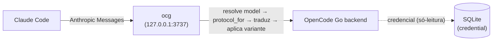

# Arquitetura

[← README](../README.md) · [Configuração](configuracao.md) · [CLI](config-cli.md) ·
[Desktop](config-desktop.md) · [Erros](erros.md) · [Dev](dev.md) ·
**Arquitetura**

`opencode-claude-gateway` é um gateway local compatível com Anthropic que expõe os
modelos do OpenCode v2 ao Claude Code. Escuta apenas em `127.0.0.1` e **nunca**
fala com a Anthropic — o upstream é o backend Go/Console do OpenCode, roteado
pelo pacote (provider).

## Camadas

- **`domain/`** — tipos e regras puras, sem async (`mod.rs` só re-exporta).
  `model.rs` (`ModelRef`: provider/model, sufixo `#variant`), `catalog.rs`
  (`CatalogEntry` deserializa a saída de `opencode api get /api/model`, incl.
  `variants`, headers/body por modelo, limites de contexto e linhas de `id`
  distintas), `protocol.rs` (`protocol_for_entry` → protocolo de wire, incl.
  `settings.endpoint` para catálogos mistos `github-copilot`), `alias.rs`
  (`auto_aliases_for` — o id do gateway precisa conter `claude`/`anthropic`
  para a descoberta de `/v1/models` do Claude Code;
  `shield_cli_family_match` reescrita automática do spelling de família nos
  ids anunciados — `claude-sonnet` → `cs`, `claude-opus` → `co`, mais
  `haiku`/`fable`/`mythos` — via `cli_shield_aliases`, default on, para as
  chamadas de fundo do CLI não caírem nessas linhas; reescrita opt-in
  `desktop_aliases` para a denylist do Desktop; `strip_window_suffix` para os
  hints `[1m]`/`[200k]` que o Claude Code anexa a ids desconhecidos).
- **`infra/opencode.rs`** — estado do OpenCode. Credenciais **somente** da tabela
  `credential` da SQLite (read-only; `auth.json` nunca é fonte de verdade; nunca
  parseia `opencode.jsonc`). Catálogo via `opencode api get /api/model`. Caminho
  do DB via `opencode debug paths db`.
- **`infra/upstream/`** — tradutores puros (sem HTTP; `upstream.rs` re-exporta
  a superfície pública mais `join_url`):
  - `chat.rs`: `anthropic_to_openai` / `openai_to_anthropic` (Chat Completions)
  - `responses.rs`: `anthropic_to_responses` / `responses_to_anthropic` (Responses API)
  - `stream.rs`: `StreamTranslator` / `ResponsesTranslator` (SSE → Anthropic SSE)
  - `variant.rs`: `apply_variant` — mescla o `reasoning_effort` da variante
    selecionada no body **já traduzido** (os tradutores descartam campos
    desconhecidos). Chave por protocolo: Chat = `reasoning_effort` (labels fora
    do enum da OpenAI saturam para `high`), Responses = `reasoning`, Anthropic
    = no-op.
  - `shared.rs` (interno ao crate): `floor_output_tokens` + o shaping
    compartilhado de imagem/tool-result/body dos dois conversores.
  - `estimate.rs`: `estimate_tokens` — contagem local por partes para
    `count_tokens` (sem tokenizer).
  - `heartbeat.rs`: `with_heartbeat` — injeta `event: ping` durante o silêncio
    do upstream; `sse` / `sse_error` — frames Anthropic mid-stream.
- **`api/server.rs`** — handlers Axum. Fluxo do body: resolve model → escolhe o
  forward por `protocol_for` → traduz → aplica variante → forward com o
  `Bearer` da credencial + headers de sessão (`x-opencode-session`, sempre enviado).

## Convenções e pegadinhas

- **Resolução de modelo** (`AppState::resolve`): alias → `provider/model` → id
  simples (ids ambíguos ordenam por nome qualificado, com aviso). Variantes são
  validadas contra o catálogo; label desconhecido → 404 listando as disponíveis.
- **Free-tier**: modelos `opencode/*` dão 403 fora do OpenCode, então ficam
  ocultos de `/v1/models` a menos que `include_free_tier = true`. Usam a chave
  pública de `settings.apiKey` (`upstream_bearer`).
- **Headers de sessão**: o forward para o Go sempre envia `x-opencode-session`
  (o `x-claude-code-session-id` do cliente, depois `x-opencode-session`, senão um
  fallback persistido em `ocg.session`).
- **count_tokens**: pacotes Anthropic fazem proxy para
  `{baseURL}/messages/count_tokens` com fallback em `estimate_tokens`; os outros
  pacotes sempre estimam localmente.
- **Formato de erro**: sempre `{"type":"error","error":{"type":...,"message":...}}`
  com tipos de erro Anthropic (`not_found_error`, `authentication_error`,
  `invalid_request_error`, `api_error`).
- **Refresh do catálogo** roda em background após o bind; `/health` fica
  `starting` até o primeiro sucesso, `degraded` após falha, `ok` caso contrário.
  Os testes constroem um `AppState` semeado e nunca chamam o binário real.

## Daemon e ciclo de vida

- `ocg --enable` escreve pidfile/porta/sessão em
  `~/.local/share/opencode-claude-gateway/` (arquivos `0600` via `daemon::write_private`)
  e spawna o filho com `--daemon-child`.
- `--disable` envia SIGTERM (drena os streams SSE em andamento) e limpa o estado.
- `--status` reporta se o daemon está rodando, em qual porta e o session id.

## Limites conhecidos

- `count_tokens` é estimativa local por partes (sem tokenizer BPE): texto ≈ 1 token/4 chars,
  +overhead por mensagem/tool, imagens base64 pelo tamanho real. Para pacotes Anthropic há proxy
  para `{baseURL}/messages/count_tokens` (com fallback na estimativa se o upstream falhar).
- Modelos free-tier `opencode/*` são bloqueados no upstream fora do OpenCode (ocultos por padrão).
- `ocg.log` é só-append: trunque de vez em quando (`: > ocg.log`).
- `--enable` recusa uma `--port` diferente com ele rodando; dê `--disable` antes.

## Documentação relacionada

- [Desenvolvimento](dev.md) — building, testes, comandos.
- [Configuração](configuracao.md) — `config.toml`, aliases e variantes.
- [Erros e diagnóstico](erros.md) — saúde, logs e sintomas.
- [Setup no Claude Code CLI](config-cli.md) — config e uso no dia a dia.
- [Setup no Claude Desktop](config-desktop.md) — o app Desktop.